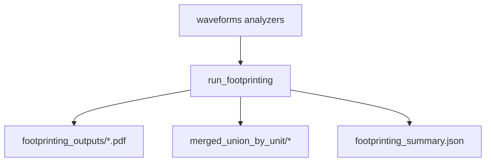

# Footprinting

Computes footprint (e.g. peak-to-peak) maps from per-unit templates across sources and produces curated/uncurated QC PDFs.

This step is intentionally decoupled from template extraction: it reads the waveforms analyzers directly.

## Primary API

- Inputs: `axon_reconstructor.pipeline.footprinting.FootprintingInputs`
- Outputs: `axon_reconstructor.pipeline.footprinting.FootprintingOutputs`
- Runner: `axon_reconstructor.pipeline.footprinting.run_footprinting(inputs=...)`

## Inputs

- `h5_path`, `stream_id`, `mea_output_root`
- unit selection: `unit_ids`, `unit_limit`
- plotting controls (concat grids + multi-source overlays)
- `n_jobs`, `force_restart`

This step reads waveforms analyzers from:

- `<well>/waveforms_outputs/concat_waveforms/`
- `<well>/waveforms_outputs/segment_waveforms/*/`

## Outputs (artifacts)

Under `<well>/footprinting_outputs/`:

- Concat-only grids
  - `footprints_grid_concat.pdf`
  - `footprints_grid_concat_curated.pdf`
- By-source overlays
  - `footprints_by_source/` + `footprints_by_source_summary.json`
  - `footprints_by_source_uncurated/` + `footprints_by_source_uncurated_summary.json`
- Merged union footprints
  - `merged_union_by_unit/` + `merged_union_summary.json`
  - `merged_union_by_unit_uncurated/` + `merged_union_uncurated_summary.json`
- Summary
  - `footprinting_summary.json`

## Exclusions + curation

- `wf_exclusions.npz` is deprecated and not required.
- This step does not apply spike-level exclusions; curated vs uncurated differs only by the unit list (waveforms-stage curation when available).

## Mermaid flow

## Notes

- Footprinting is useful both as a QC product and as an input to reconstruction heuristics.

Implementation note: footprinting uses the waveforms analyzer `templates` extension as the template source for each unit.
