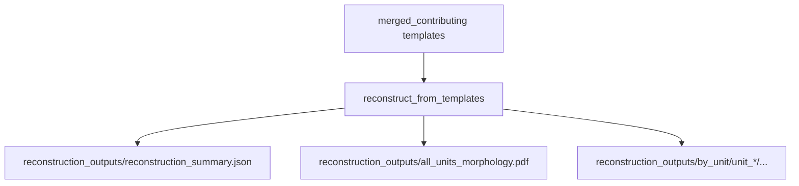

# Reconstruction

Runs axon reconstruction / velocity estimation using `axon_velocity`, consuming merged contributing-channels templates from the templates step.

Produces per-unit and all-units PDF summaries plus a JSON summary.

## Primary API

- Inputs: `axon_reconstructor.pipeline.reconstruction.ReconstructionInputs`
- Outputs: `axon_reconstructor.pipeline.reconstruction.ReconstructionOutputs`
- Runner: `axon_reconstructor.pipeline.reconstruction.reconstruct_from_templates(inputs=...)`

## Inputs

- `h5_path`, `stream_id`, `mea_output_root`
- unit selection: `unit_ids`, `unit_limit`
- `axon_velocity_params`: overrides for the axon_velocity call (best-effort filtered to accepted kwargs)
- plotting controls: `write_unit_pdfs`, `write_all_units_overview_pdf`
- `verbose`, `force_restart`

## Inputs consumed (from templates)

From `<well>/templates_outputs/merged_units/unit_<id>/`:

- `merged_contributing_template.npy`
- `merged_contributing_channel_locations.npy`
- `merged_contributing_template_meta.json`

## Outputs (artifacts)

Under `<well>/reconstruction_outputs/`:

- `reconstruction_summary.json`
- `all_units_morphology.pdf` (optional)
- `by_unit/unit_<id>/`
  - per-unit JSON outputs and per-unit PDFs (when enabled)

## Mermaid flow

## Notes

- This step uses a dedicated reconstruction checkpoint file so it can resume independently of earlier stages.
