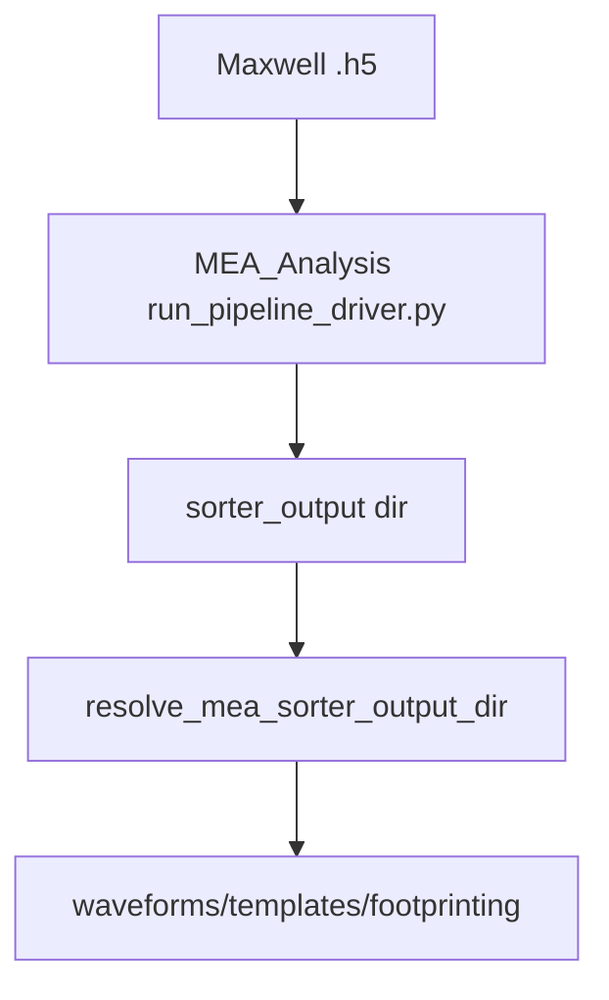

# Spikesorting

This step is a thin integration layer around **MEA_Analysis**.

It does not run a sorter directly in this package; instead it:
- constructs MEA_Analysis driver command-lines
- resolves and validates the expected sorter output directories

## Primary API

- `axon_reconstructor.pipeline.spikesorting.SpikeSortRequest`
- `axon_reconstructor.pipeline.spikesorting.resolve_mea_sorter_output_dir(req)`
- `axon_reconstructor.pipeline.spikesorting.validate_sorter_output(sorter_output_dir)`
- `axon_reconstructor.pipeline.spikesorting.build_mea_analysis_driver_cmd(...)`

## Inputs

- `data_file`: the Maxwell `.h5`
- `mea_output_root`: MEA_Analysis output root
- `well` / `stream_id`: per-well identifier used by MEA_Analysis path contracts
- `sorter`: sorter name (default: `kilosort4`)

## Outputs (artifacts)

Outputs are produced by MEA_Analysis, typically under a per-well folder like:

- `<mea_output_root>/<...>/<well>/sorter_output/`
  - sorter-specific files (binary, logs, spike times, clusters, etc.)
  - later stages consume these outputs to build a `Sorting` object

## Mermaid flow

## Notes

- This package intentionally keeps the integration surface small so it’s easier to swap sorters / run on different systems (local vs HPC).
