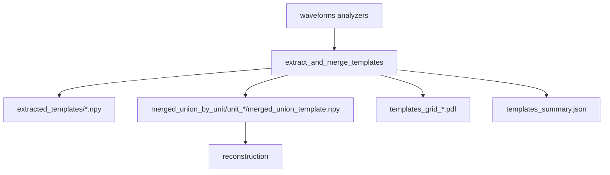

# Templates

Extracts per-unit templates from waveforms analyzers and builds a **merged_union** template per unit across sources.

This step also produces curated/uncurated QC PDFs and JSON summaries.

## Primary API

- Inputs: `axon_reconstructor.pipeline.templates.TemplateExtractInputs`
- Outputs: `axon_reconstructor.pipeline.templates.TemplateExtractOutputs`
- Runner: `axon_reconstructor.pipeline.templates.extract_and_merge_templates(inputs=...)`

## Inputs

- `h5_path`, `stream_id`, `mea_output_root`
- include sources: `include_concat`, `include_segments`
- unit selection: `unit_ids`, `unit_limit`
- auto-merge (optional): `run_unit_merging`, `merge_presets`, `merge_recursive`
- plotting controls: `plot_templates_grid_pdf`, `plot_multi_source_templates_pdf`, `top_channels_per_template`
- `n_jobs`, `force_restart`

This step reads waveforms analyzers from:

- `<well>/waveforms_outputs/concat_waveforms/`
- `<well>/waveforms_outputs/segment_waveforms/*/`

## Outputs (artifacts)

Under `<well>/templates_outputs/`:

- Extracted templates
  - `extracted_templates/` (per-source `.npy` templates + metadata)
- Merged templates
  - `merged_union_by_unit/unit_<id>/`
    - `merged_union_template.npy`
    - `merged_union_channel_locations.npy`
    - `merged_union_template_meta.json`
- QC PDFs
  - `templates_grid_uncurated.pdf`
  - `templates_grid_curated.pdf` (uses waveforms-stage curated unit list when available)
  - `multi_source_by_unit/` (optional per-unit overlays)
  - `multi_source_by_unit_uncurated/` (optional)
- Summaries
  - `templates_summary.json`

## Exclusions + curation

- `wf_exclusions.npz` is deprecated and not required.
- This step does not apply spike-level exclusions; curated vs uncurated differs only by the unit list (waveforms-stage curation when available).

## Mermaid flow

## Notes

- The merged_union outputs are the canonical handoff for reconstruction.
