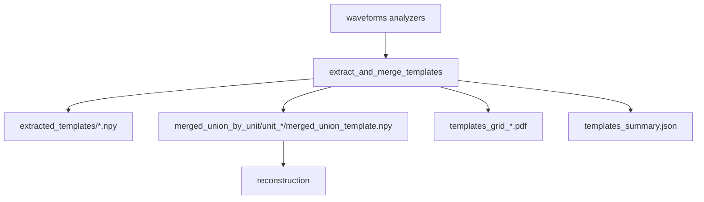

# Templates

Extracts per-unit templates from waveforms analyzers and builds a **merged_union** template per unit across sources.

This step produces QC PDFs and a JSON summary.

## Scientific methods (data handling)

This stage is designed to produce *scientifically defensible* per-unit template waveforms for downstream reconstruction.

- **Source of truth**: templates are derived from the waveforms-stage `SortingAnalyzer` artifacts.
  This stage does **not** re-run spike detection/sorting.
- **No downstream spike-level filtering**: spike-level exclusions belong to the waveforms stage.
  This stage only selects which unit ids are processed (using waveforms-stage unit curation when available).
- **Multi-source rationale (concat vs per-segment)**:
  - The concat analyzer provides templates on the stable channel set used for sorting.
  - Optional per-segment analyzers can recover templates on channels absent from concat (e.g., not present in all segments).
- **Merged-union channel set**: for each unit, a `merged_union` template is constructed by taking the union of channels
  across sources.
- **Overlap handling**: when multiple sources contribute the *same physical channel* (matched by electrode id/channel id
  or spatial location), the waveform for that channel is merged using a mean-of-waveforms strategy (best-effort) to avoid
  keep-first bias.
- **Footprints**: the peak-to-peak amplitude (PTP) across time is computed per channel for the `merged_union` template.
  Both linear and log-scaled visualizations are written as quick-look QC.

## Primary API

- Inputs: `axon_reconstructor.pipeline.templates.TemplateExtractInputs`
- Outputs: `axon_reconstructor.pipeline.templates.TemplateExtractOutputs`
- Runner: `axon_reconstructor.pipeline.templates.extract_and_merge_templates(inputs=...)`

## Inputs

- `h5_path`, `stream_id`, `mea_output_root`
- include sources: `include_concat`, `include_segments`
- unit selection: `unit_ids`, `unit_limit`
- auto-merge (optional): `run_unit_merging`, `merge_presets`, `merge_recursive`
- plotting controls: `plot_templates_grid_pdf`, `plot_multi_source_templates_pdf`, `plot_templates_grid_panels_svg`, `top_channels_per_template`
- footprints: `plot_merged_union_footprints_linear_and_log`
- `n_jobs`, `force_restart`

This step reads waveforms analyzers from:

- `<well>/waveforms_outputs/concat_waveforms/`
- `<well>/waveforms_outputs/segment_waveforms/*/`

## Outputs (artifacts)

Under `<well>/templates_outputs/`:

- Extracted templates
  - `extracted_templates/` (per-source `.npy` templates + metadata)
- Merged templates
  - `merged_union_by_unit/unit_<id>/`
    - `merged_union_template.npy`
    - `merged_union_channel_locations.npy`
    - `merged_union_template_meta.json`
    - `merged_union_footprint_ptp.npy` (peak-to-peak amplitude per channel)
    - `axon_velocity_inputs.npz` (convenience bundle for plotting/reconstruction)
    - `merged_union_footprint_ptp_linear.png` (PTP map)
    - `merged_union_footprint_ptp_log.png` (PTP map, log)
    - `merged_union_template_footprint_linear.svg` (vector panel)
    - `merged_union_template_footprint_log.svg` (vector panel, log footprint)
- QC PDFs
  - `templates_grid.pdf`
  - `templates_grid_panels_svg/` (per-unit SVG panels, linear + log footprint)
  - `multi_source_by_unit/` (optional per-unit overlays)
- Summaries
  - `templates_summary.json`

## Exclusions + curation

- `wf_exclusions.npz` is deprecated and not required.
- This step does not apply spike-level exclusions; curation here refers only to which unit ids are processed (waveforms-stage curation when available).

## Mermaid flow

## Notes

- The merged_union outputs are the canonical handoff for reconstruction.
