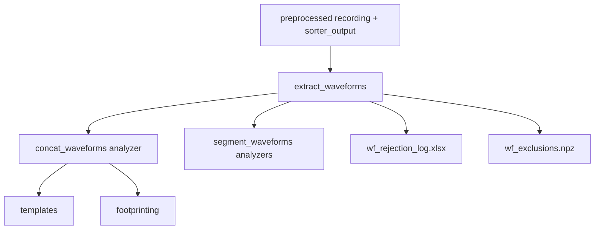

# Waveforms

Extracts SpikeInterface `SortingAnalyzer` waveforms (concat and optionally per-segment) and produces QC artifacts.

This is also the **source of spike-level waveform exclusions** (persisted for downstream steps as `wf_exclusions.npz`).

## Primary API

- Inputs: `axon_reconstructor.pipeline.waveforms.WaveformExtractInputs`
- Outputs: `axon_reconstructor.pipeline.waveforms.WaveformExtractOutputs`
- Runner: `axon_reconstructor.pipeline.waveforms.extract_waveforms(inputs=...)`

## Inputs

- `h5_path`, `stream_id`, `mea_output_root`, `sorter`
- waveform cutout: `ms_before`/`ms_after` (or inferred from Maxwell trigger metadata)
- `per_segment`, `per_segment_only_additional_channels`
- `filter_by_maxwell_epochs`: drop spikes whose window crosses Maxwell snippet boundaries
- `force_restart`, `n_jobs`, `max_spikes_per_unit`

## Outputs (artifacts)

Under `<well>/waveforms_outputs/`:

- Analyzer folders
  - `concat_waveforms/` (SortingAnalyzer)
  - `segment_waveforms/segXX_<rec_name>/` (optional)
- PDFs
  - `waveforms_grid_uncurated.pdf`
  - `waveforms_grid_curated.pdf` (if curation succeeds)
- Curation / metrics tables (best-effort)
  - `qm_unfiltered.xlsx`, `tm_unfiltered.xlsx`
  - `metrics_curated.xlsx`, `tm_curated.xlsx`
- Rejection / filtering logs
  - `rejection_log.xlsx` (legacy/MEA_Analysis style)
  - `wf_rejection_log.xlsx` (per-spike rows)
  - `wf_exclusions.npz` (compact per-spike exclusions; consumed by templates/footprinting)
- JSON summaries
  - `waveforms_params.json`
  - `waveforms_filtering.json`

## How exclusions work

- Exclusions are represented as `(source_name, unit_id, spike_sample)`.
- Downstream steps use `waveforms.exclusions.load_wf_exclusions_by_source(...)` and apply them when averaging waveforms into templates.

## Mermaid flow

## Notes

- This step is designed to be resumable via a dedicated waveforms checkpoint file.
- If `filter_by_maxwell_epochs=True`, provide epoch marker JSONs from raw preprocessing (or let the pipeline generate them).
