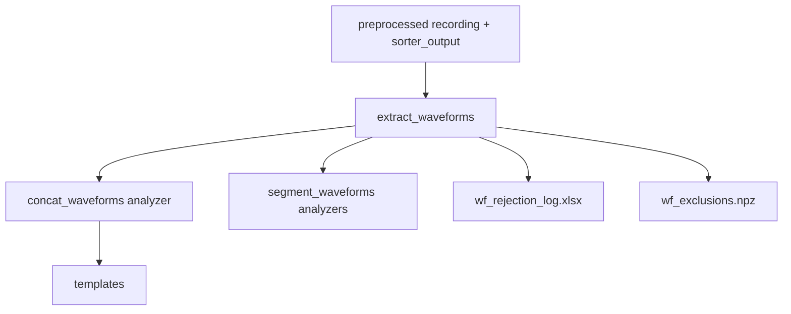

# Waveforms

Extracts SpikeInterface `SortingAnalyzer` waveforms (concat and optionally per-segment) and produces QC artifacts.

This stage produces waveform analyzers and a **spike-level rejection log** (`wf_rejection_log.xlsx`) that can be used for debugging/audit.

## Scientific methods (data handling)

This stage is designed to produce *scientifically defensible* waveform snippets and templates for downstream steps.

- **Consistent time base**: the main analyzer is computed on the *preprocessed concatenated recording* used for sorting.
  Spike times are treated in this concatenated sample index space.
- **Waveform windowing**: waveforms are extracted using a fixed cutout window (`ms_before`/`ms_after`). If not provided,
  the window can be inferred from acquisition/trigger metadata so that extracted snippets match the experimental timing.
- **Epoch-aware exclusion to prevent boundary artifacts**: Maxwell recordings can contain snippet discontinuities.
  When preprocessing provides contiguous-epoch markers, spikes whose waveform window would cross an epoch boundary are
  excluded. This prevents averaging waveform snippets that mix unrelated signal segments.
- **Concat vs per-segment analyzers**:
  - **Concat analyzer** represents the channel set used for sorting (often the electrode intersection across segments).
  - **Per-segment analyzers** optionally extract waveforms on *raw* segment recordings to recover waveforms on electrodes
    that were dropped during concatenation (channels not present in all segments).
  - **Per-segment preprocessing parity**: by default, raw segment recordings are additionally preprocessed to mimic
    MEA_Analysis (unsigned->signed if needed, 300 Hz high-pass, common median reference, float32 cast). This reduces
    risk that per-segment waveforms differ purely due to preprocessing mismatch.
  - **Why per-segment waveforms reuse concat spike times (Kilosort4 context)**:
    - Kilosort4 is a template-matching spikesorter: it detects events and assigns them to units by fitting learned
      templates (with drift handling) on the *same concatenated, preprocessed recording* used for sorting.
      The resulting spike trains are therefore defined in the concatenated time base.
    - Re-running detection/sorting independently per segment would generally produce different spike trains and even
      different unit identities (because template learning, drift estimates, thresholds, and noise statistics differ).
      That would make per-segment waveforms scientifically incomparable to the concat results.
    - This stage is therefore **waveform extraction only**: it takes the concat spike trains and maps them into each
      segment's local sample coordinates (via the concat epoch start/end), then extracts snippets on the raw channels.
- **Controlled sampling for tractable computation**: analyzers typically compute waveforms from a random subset of spikes
  per unit (`max_spikes_per_unit`), which bounds runtime while preserving representative waveform statistics.
- **Metrics, merging, and curation**:
  - Quality/template metrics are computed per analyzer source (concat + each segment) and merged.
  - A merged table drives MEA_Analysis-style curation thresholds, producing curated metrics and rejection logs.
  - Metrics parameters may adapt to recording/segment duration for stability (e.g., binning choices for presence metrics).
- **Audit trail + reproducibility**: aggregate summaries and spike-level rejection rows are persisted so downstream
  steps can diagnose filtering decisions.

## Primary API

- Inputs: `axon_reconstructor.pipeline.waveforms.WaveformExtractInputs`
- Outputs: `axon_reconstructor.pipeline.waveforms.WaveformExtractOutputs`
- Runner: `axon_reconstructor.pipeline.waveforms.extract_waveforms(inputs=...)`

## Inputs

- `h5_path`, `stream_id`, `mea_output_root`, `sorter`
- waveform cutout: `ms_before`/`ms_after` (or inferred from Maxwell trigger metadata)
- `per_segment`, `per_segment_only_additional_channels`
- `filter_by_maxwell_epochs`: drop spikes whose window crosses Maxwell snippet boundaries
- `per_segment_preprocess_like_mea_analysis`: apply MEA_Analysis-like preprocessing to per-segment recordings before extraction
- `force_restart`, `n_jobs`, `max_spikes_per_unit`

## Outputs (artifacts)

Under `<well>/waveforms_outputs/`:

- Analyzer folders
  - `concat_waveforms/` (SortingAnalyzer)
  - `segment_waveforms/segXX_<rec_name>/` (optional)
- PDFs
  - `waveforms_grid_uncurated.pdf`
  - `waveforms_grid_curated.pdf` (if curation succeeds)
- Curation / metrics tables (best-effort)
  - `qm_unfiltered.xlsx`, `tm_unfiltered.xlsx`
  - `metrics_curated.xlsx`, `tm_curated.xlsx`
- Rejection / filtering logs
  - `rejection_log.xlsx` (legacy/MEA_Analysis style)
  - `wf_rejection_log.xlsx` (per-spike rows)
  - `wf_exclusions.npz` (deprecated; no longer written by default)
- JSON summaries
  - `waveform_extraction_params.json`
  - `waveform_filtering_summary.json`

## How exclusions work

- Exclusions are represented as `(source_name, unit_id, spike_sample)`.
- `wf_exclusions.npz` is deprecated; prefer consuming the `SortingAnalyzer` outputs directly.

## Mermaid flow

## Notes

- This step is designed to be resumable via a dedicated waveforms checkpoint file.
- If `filter_by_maxwell_epochs=True`, provide epoch marker JSONs from raw preprocessing (or let the pipeline generate them).
